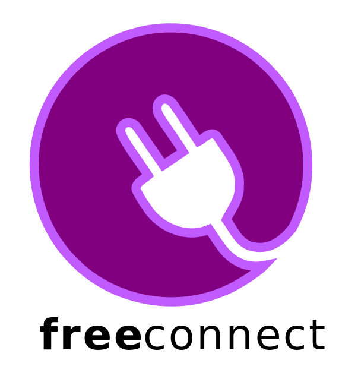

===========
Freeconnect
===========

Freeconnect is a collection of connectors with open source design files and documentation.
These connectors offer a solution for In-circuit connection, the connecion is made through *pogo* pins, meaning no mating connector is required on the target side, only that the small footprint is there.

-------------
Documentation
-------------

Head over to the documentation `webpage`_.

.. _webpage: https://perigoso.github.io/freeconnect/
