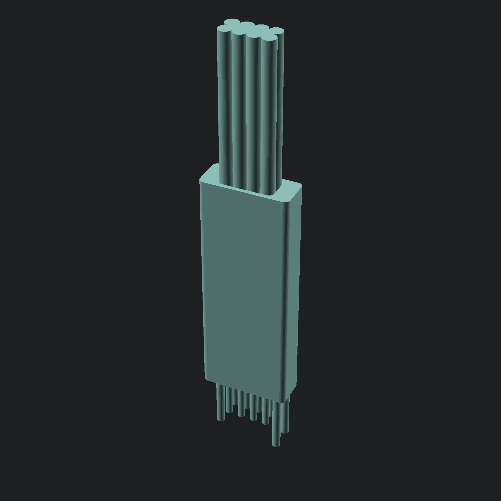
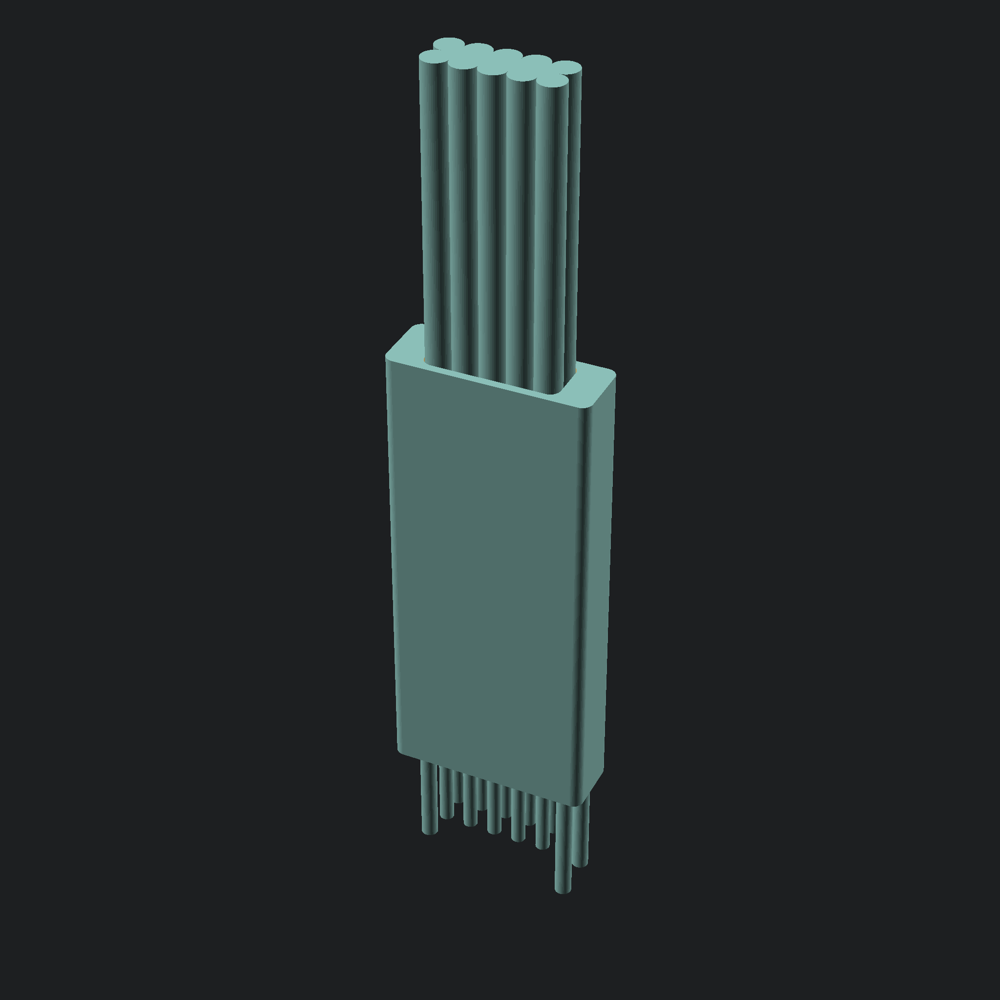
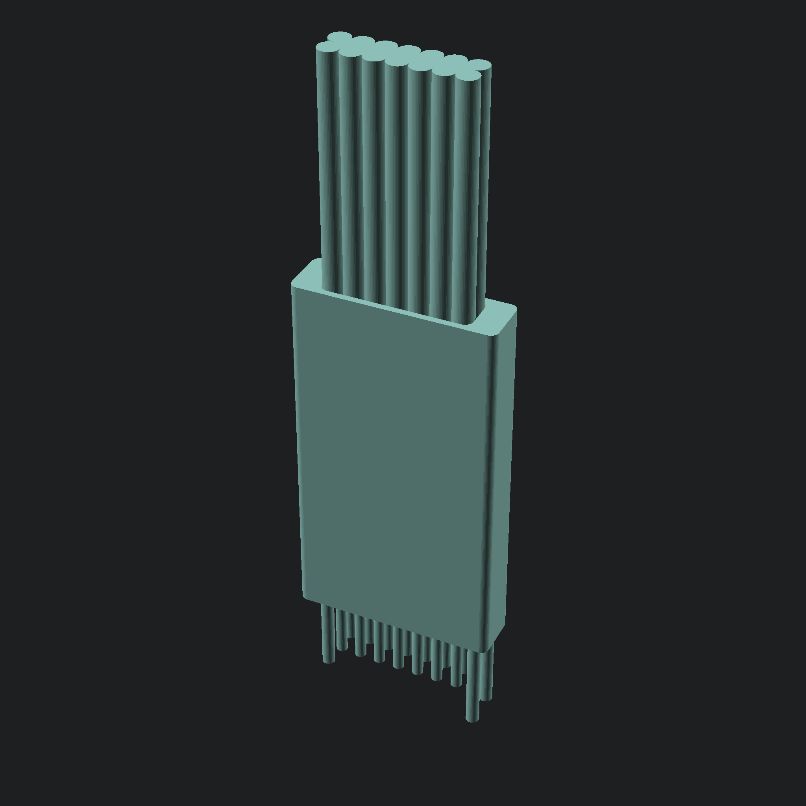
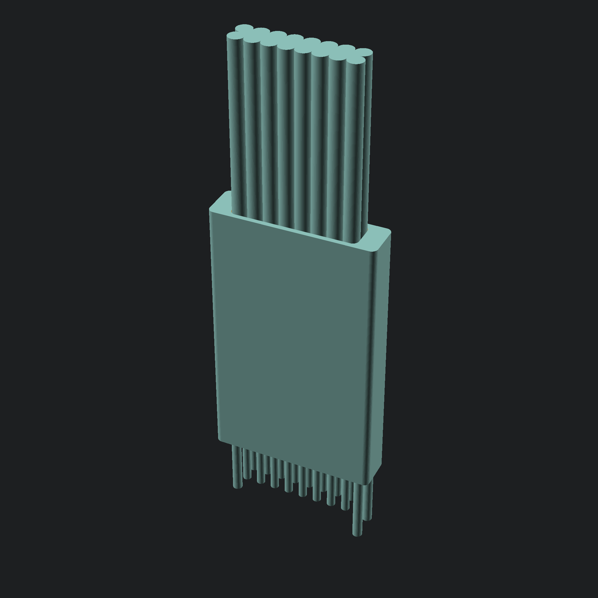
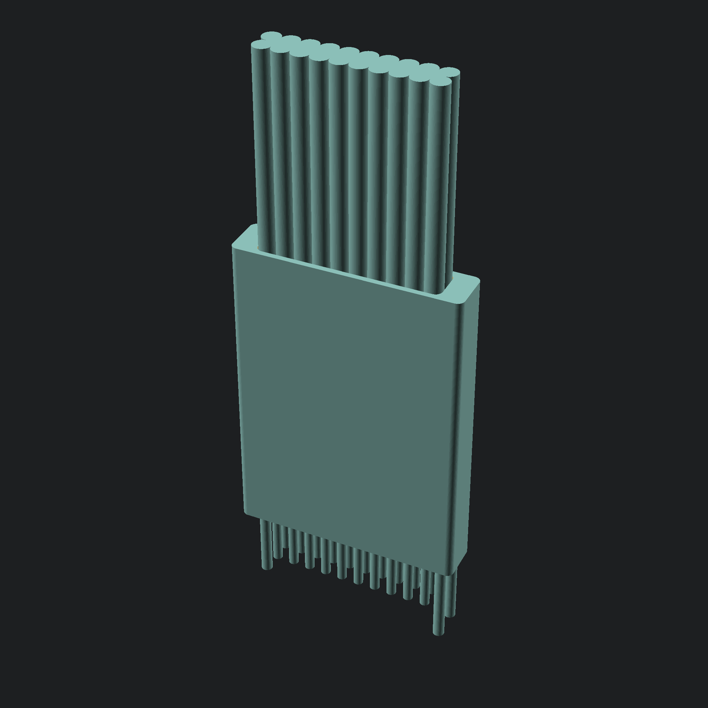
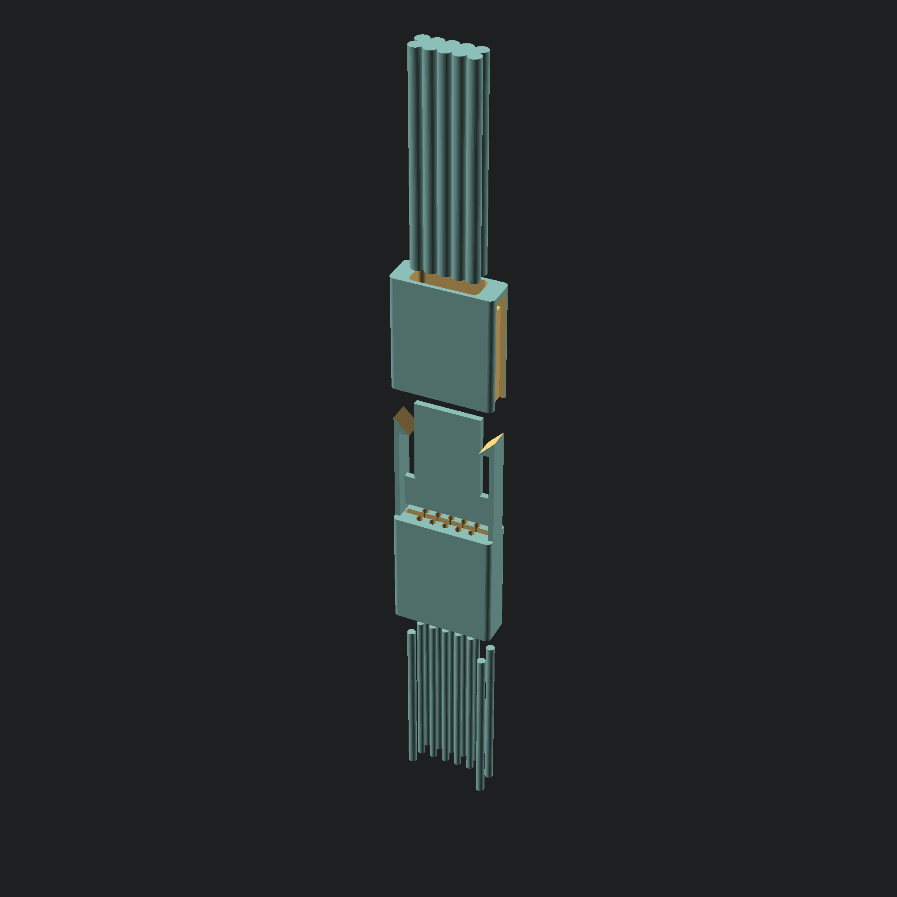

:hide-toc:

***********
freeconnect
***********

*freeconnect* is a project that aims to provide a family of no mating required, small footprint connectors for in-circuit connection,
providing a means to program and debug pcbs without the added cost and assembly of traditional mating connectors.
The main focus of the project is to provide an open, free to use, cheap, reproducible at home alternative to existing (expensive, and unobtainable) solutions on the market.

I hope to help community develop their projects by providing an accessible solution without having to worry about
issues like availability, prohibitive cost, or proprietary IP.

The aim is to also provide Footprints for most/all EDAs.

Planned is also a cheat sheet of connections for the various connectors and applications (JTAG, SWD, UART, SPI, etc...)

State of the project
====================

I have prototyped connectors with 6 and 10 connections, with very positive results.

The internal pcbs were made with 2 layers, which made it impossible to do odd-even pinout, 4 layer is a consideration, but the 0.6mm thickness is a requirement making this a slighlty harder problem.

As is the connectors are ready for early adopters, improvements need to be made.

.. admonition:: Roadmap

   - Mechanical design [Done!]
   - Internal pcb design [WIP]
   - Footprints
   - Snap-in versions
   - Snap-less holding solution (flexible material? pcb with sockets?)
   - clean up the OpenSCAD scripts
   - Compile a cheat sheet of recomended connections

Early prototypes
-----------------

.. image:: assets/early_prototype.jpg
  :width: 800

.. image:: assets/sbs.jpg
  :width: 800

.. image:: assets/first_working_prototypes_.jpg
  :width: 800

.. image:: assets/first_working_prototypes.jpg
  :width: 800

Mechanical design
-----------------

.. image:: assets/fc203.png
  :width: 400

Stack up
--------

Available Solutions (planned)
-------------------

+------------+---------+-----------+
| Name       | No pins | Pinout    |
+============+=========+===========+
| fc203u     |         | DIP style |
+------------+  6      +-----------+
| fc203z     |         | Odd-even  |
+------------+---------+-----------+
| fc204u     |         | DIP style |
+------------+  8      +-----------+
| fc204z     |         | Odd-even  |
+------------+---------+-----------+
| fc205u     |         | DIP style |
+------------+  10     +-----------+
| fc205z     |         | Odd-even  |
+------------+---------+-----------+
| fc207u     |         | DIP style |
+------------+  14     +-----------+
| fc207z     |         | Odd-even  |
+------------+---------+-----------+
| fc208u     |         | DIP style |
+------------+  16     +-----------+
| fc208z     |         | Odd-even  |
+------------+---------+-----------+
| fc210u     |         | DIP style |
+------------+  20     +-----------+
| fc210z     |         | Odd-even  |
+------------+---------+-----------+

Making the connectors
=====================

arquitecture/Core technologies
------------------------------

There are some technologies and specific materials that allow this to be possible:

2 Row by X column design with ``1.27mm`` pitch:
  This choice allows compatibility with existing solutions, and relies on a dimension.

Automated/scripted generation:
  I am trying to rely on scripting/automation were possible, this allows for a consistent range of connectors, and allows me or annyone to easily modify them for specific needs.

  Right now the 3 model is completely reliant o OpenSCAD, and many parameters are costumizable.

Resin 3d printing:
  After unsuccessful attemps at making the required mechanical parts with fdm 3d printing, It is clear the detail/resolution allowed by
  resin 3d printing is a requirement to reproduce them.

  The equipment i had success with so far:

  - creality LD-002R printer.
  - Anycubic clear resin.
  - SIRAYA Tech Blu resin.

Pogo pins:
  This is core to the connectors, there are some details this current solution relies on, for instance the diameter of the pogos chosen is ``0.68mm``
  this is rather convinient, because at ``1.27mm`` spacing, this allows almost exactly 0.6mm between them, which is a standard thickness for PCBs,
  one which is available from pototype manufacturers without added cost.

  The pin I have chosen to work with is the ``P50-Q1``, It seems to be reasonably standardized and available, at least from chinese suppliers (example `Listing <hhttp://alishort.com/lNEDq>`_).

  There are other viable options from the same series, I chose this model because the tip seemed to be the most appropriate for me.

  If you are looking for an alternative, make sure it is aroun ``0.68mm`` in diameter and around ``16.35mm`` long to allow use of the standard models i will provide
  You can ofcourse generate your own with different dimensions

Dowel/Alignment pins:
  The alignment pins are arranged in a "triangle" of sorts, one single centered on one end, two equally spaced on the other end.

  The spacing from the alignment pins to the pogo pins is ``1.27mm``, the distance between the two alignment pins on one side is ``2.03mm``,
  the dowels are standard ``0.8mm`` diameter ``16mm`` long pins readily available (`Chinese supplier Listing <https://www.aliexpress.com/item/32909884152.html>`_, also available from `mcmaster <https://www.mcmaster.com/>`_).

  The dimensions were chosen to keep compatibility with existing solutions.

cable:
  The wires/cable the design was made around is standard p``1.27mm`` ribbon cable, nothing special about it.
  The cable is folded in half in order to conserve space, and make a more direct connection with the pogo pins.
  It should be possible to use other solutions, like for instance individual wires.

PCB:
  There Exists a PCB in the Middle of the connector, it serves a couple of important purposes:
  - mechanically holds the pogo pins in place
  - holds the wires to the connector
  - provides the connection between the wires and the pogo pins

  This last item is important, it allows us to control the pinout of the connector, if we were to for instance make a direct connection between the wires
  and the pogo pins, we would be stuck with a U shapped pinout (similar to a DIP package), because of the way the cable is bent, when a odd-even arrangement is probably
  more desirable in most circumstances.

  The plan is to provide both options for every connector, a U (pinout following a U shape) and a Z option (pinout following an odd-even arrangement).

Getting the models
------------------

Standard renders of the models should be available on github `releases`_.

If you need a different model, like for instance a different pogo pin diameter, you can generate your own, take a look at **Development**.

Printing
--------

To be documented.

Assembly
--------

To be documented.

Development
===========

To be documented.

.. toctree::
   :hidden:

   Sources <https://github.com/perigoso/freeconnect>
   Issues <https://github.com/perigoso/freeconnect/issues>

.. _releases: https://github.com/perigoso/freeconnect/releases
